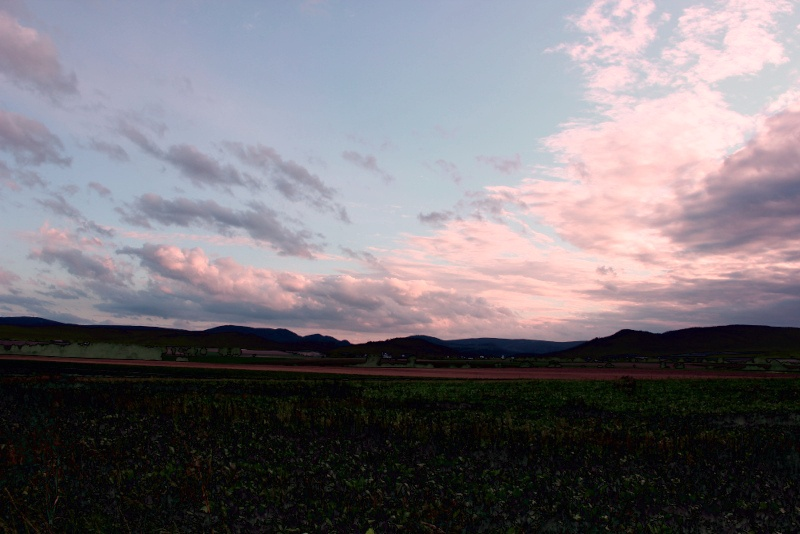
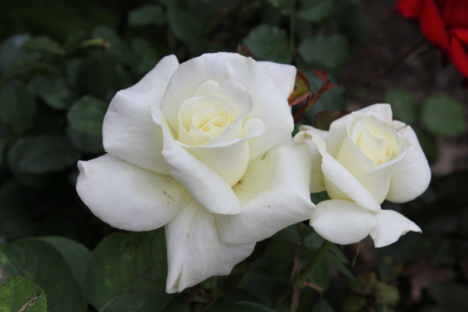
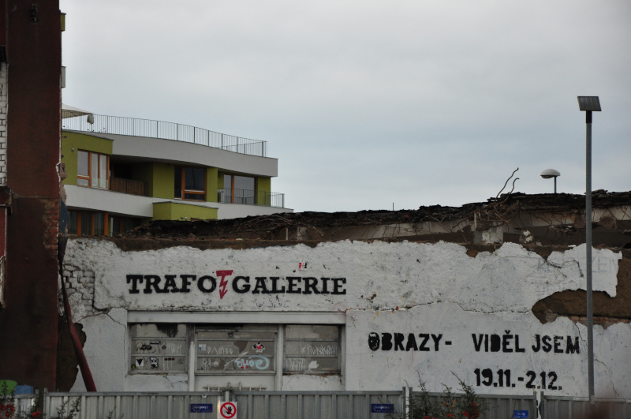
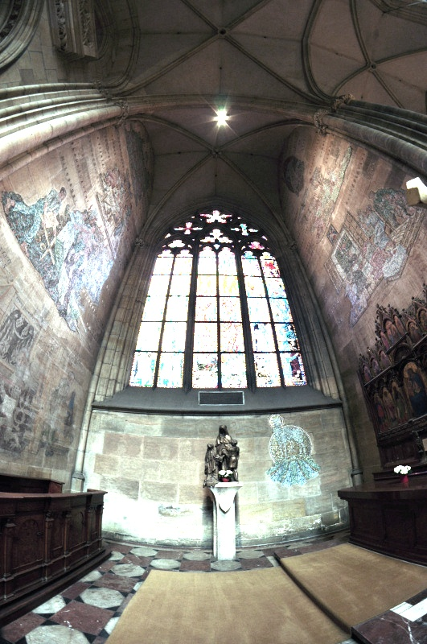

# Linear Color Transfer Methods

<table>
  <tr>
    <td>target image</td>
    <td>source image</td>
  </tr>
  <tr>
    <td></td>
    <td></td>
  </tr>
  <tr>
    <td>Reinhard</td>
    <td>SVD</td>
    <td>Cholesky</td>
  </tr>
  <tr>
    <td></td>
    <td></td>
    <td></td>
  </tr>
  <tr>
    <td>Sqrt</td>
    <td>MK</td>
  </tr>
  <tr>
    <td></td>
    <td></td>
  </tr>
</table>

Here is part of the code for my CV class project. It includes implementations of several linear color transfer methods. Most of them are relatively simple compared to non-linear methods (or methods related to ML). 

This code is written in Python and I formulated these linear methods into similar forms for comparison.

## Images
The images scotland-house.jpg and scotland_plain.jpg are from [François Pitié's repository](https://github.com/frcs/colour-transfer). Any other images in the `inputs` folder are from [https://cc0.photo/](https://cc0.photo/).

## Related Works:
- D. L. Ruderman, T. W. Cronin, and C.-C. Chiao. Statistics of cone responses to natural images: implications for visual coding. J. Opt. Soc. Am. A, 15(8):2036–2045, Aug 1998.
- E. Reinhard, M. Ashikhmin, B. Gooch, and P. Shirley. Color transfer between images. IEEE Comput. Graph. Appl., 21(5):34–41, Sept. 2001.
- F. Pitiee and A. Kokaram. The linear monge-kantorovitch linear colour mapping for example-based colour transfer. In Visual Media Production, 2007. CVMP 2007. 4th Euro-pean Conference on, pages 1–9, Nov 2007.
- X. Xiao and L. Ma. Color transfer in correlated color space. In Proceedings of the 2006 ACM International Conference on Virtual Reality Continuum and Its Applications, VRCIA’06, page 305–309, New York, NY, USA, 2006. Association for Computing Machinery.

<table>
  <tr>
    <td>target image</td>
    <td>source image</td>
  </tr>
  <tr>
    <td></td>
    <td></td>
  </tr>
  <tr>
    <td>Reinhard</td>
    <td>SVD</td>
    <td>Cholesky</td>
  </tr>
  <tr>
    <td></td>
    <td></td>
    <td></td>
  </tr>
  <tr>
    <td>Sqrt</td>
    <td>MK</td>
  </tr>
  <tr>
    <td></td>
    <td></td>
  </tr>
</table>

<table>
  <tr>
    <td>target image</td>
    <td>source image</td>
  </tr>
  <tr>
    <td></td>
    <td></td>
  </tr>
  <tr>
    <td>Reinhard</td>
    <td>SVD</td>
    <td>Cholesky</td>
  </tr>
  <tr>
    <td></td>
    <td></td>
    <td></td>
  </tr>
  <tr>
    <td>Sqrt</td>
    <td>MK</td>
  </tr>
  <tr>
    <td></td>
    <td></td>
  </tr>
</table>

<table>
  <tr>
    <td>target image</td>
    <td>source image</td>
  </tr>
  <tr>
    <td></td>
    <td></td>
  </tr>
  <tr>
    <td>Reinhard</td>
    <td>SVD</td>
    <td>Cholesky</td>
  </tr>
  <tr>
    <td></td>
    <td></td>
    <td></td>
  </tr>
  <tr>
    <td>Sqrt</td>
    <td>MK</td>
  </tr>
  <tr>
    <td></td>
    <td></td>
  </tr>
</table>
